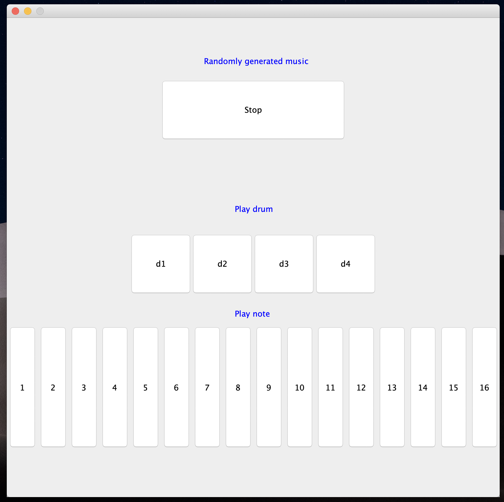
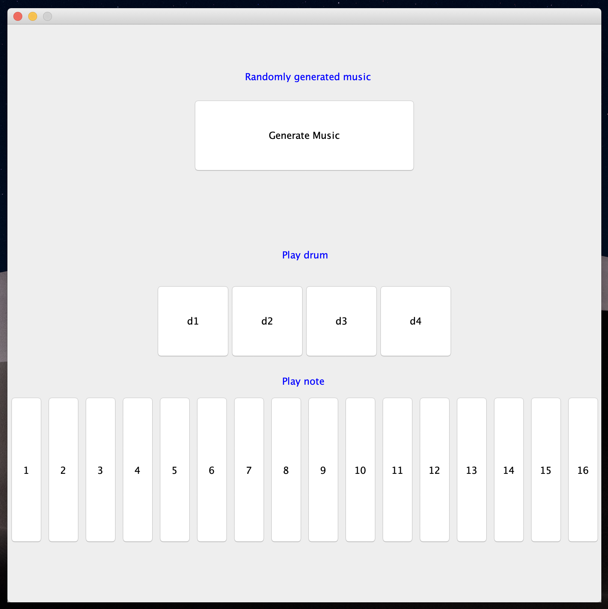

Initially intended for the repl.it hackathon, but this flops lol

highlights 

```java
		for (int i=0; i<drum.length; drum[i++] = new JButton("d"+i));
		for (int i =0; i<drum.length; panel.add(drum[i++]));

```

interface



